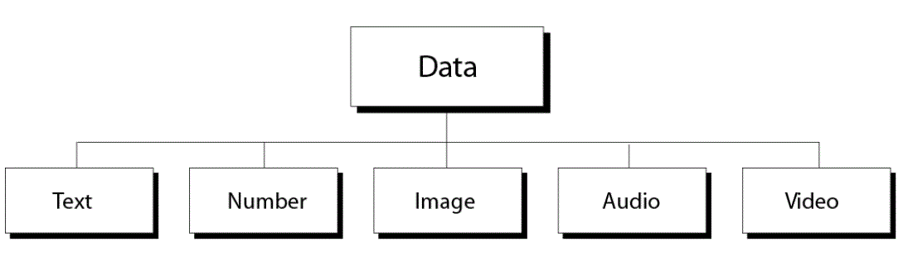
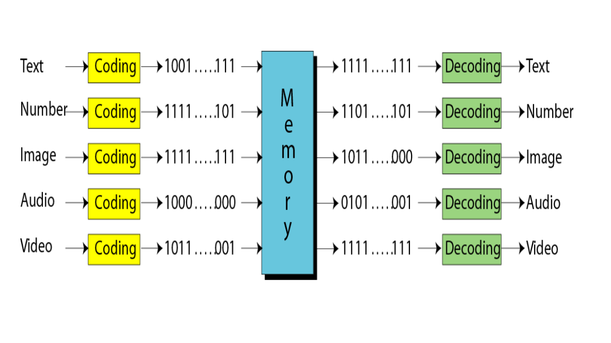
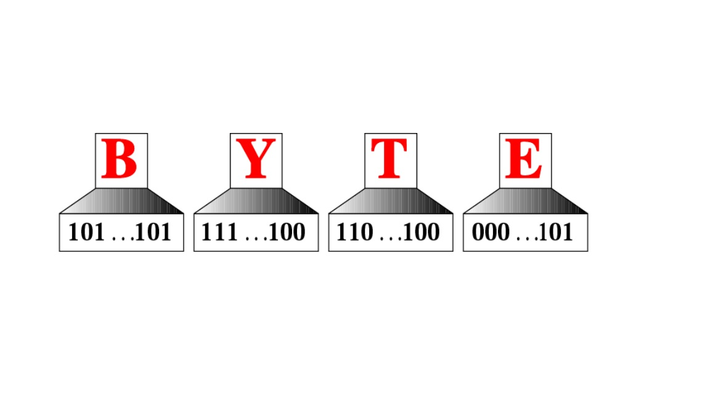


## Data Types H2

-----------------------------------------------------------

**This is only a demo.**
*MarkDown 10 Support*

=============================
#### Pre. [README](README.md)

#### Next. [Data inside the Computer](DataInsideComputer.md)

==========================

#### **Watch** H4

* [Data Representation](https://www.youtube.com/watch?v=aETnrd5ivJ4)

==========================

#### **Image** H4
+ 
+ 
+ 
 

===========================
##### **Table** H4

| Part | Page From | To | Status |
| - | :-: | :-: |-: |
| Data Types | 111| 120 | Ready |
| Data Inside Computer | 121 | 130 | N/A |
| Representing Data | 131 | 158 | N/A |

==========================
#### **Code-C** H4

```c

#include<stdio.h>

main()

{

int a,b,t=0;

scanf("%d %d",&a,&b);

if (a<b)

{

t=a;

a=b;

b=t;

}

printf("%d %d %d %d %d",(a+b),(a-b),(a/b),(a*b),(a%b));

}}
```


--------------------------------------------------------------------
>Visit my GitHub---->[MyGitHub](https://github.com/helenwang1610)

**Copyright@helenwang1610**

~~ILLEGAL USAGE~~



-----------------------------------------------------------













