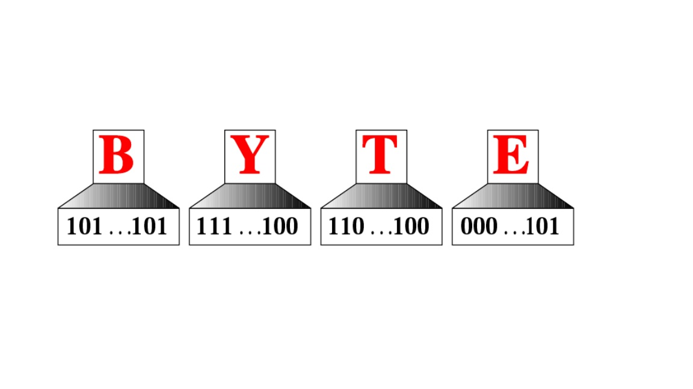


# **README**

--------------------------------------------------------------------


*After study this part, you should be able to:*

1. **Define data types.**
2. **Visualize how data are stored inside a computer.**
3. **Understand the differences between text, numbers, images, video, and audio.**

=========================


#### 1. [Data Types](DataTypes.md)

#### 2. [Data inside the Computer](DataInsideComputer.md)

#### 3. [Representing Data](RepresentingData.md)

==========================

## **Watch**

* [Data Representation](https://www.youtube.com/watch?v=aETnrd5ivJ4)
* [How to Store Data in Computer](https://www.youtube.com/watch?v=phqQM6V6r8M)
* [Multimedia](https://www.youtube.com/watch?v=yku5GXPwa6Y)

==========================
## **Image**
+ 
+ 
+ 
 

===========================
## **Table**

| Part | Page From | To | 
| - | :-: | -: |
| Data Types | 111| 120 |
| Data Inside Computer | 121 | 130 |
| Representing Data | 131 | 158 |

==========================
## **Code-Javascript**

```javascript

function printpage(myDiv){    
var newstr = document.getElementById(myDiv).innerHTML;
var oldstr = document.body.innerHTML; 
document.body.innerHTML = newstr; 
window.print(); 
document.body.innerHTML = oldstr; 
return false; 
}
```


--------------------------------------------------------------------
>Visit my Github---->[MyGithub](https://github.com/helenwang1610)

**Copyright@helenwang1610**

~~NEVER ILLEGAL USAGE~~









